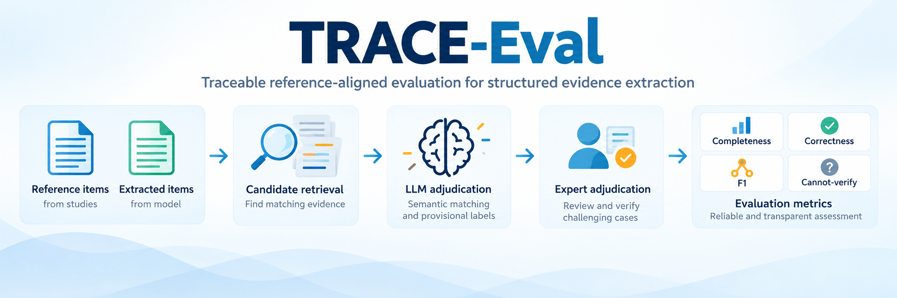

# TRACE-Eval



TRACE-Eval is a reference-aligned framework for evaluating structured evidence extraction at the level of clinically meaningful items or claim groups. It retrieves plausible matches between reference items and extracted evidence, assigns provisional labels with an LLM, supports expert adjudication, and exports the item-level record used to calculate completeness and correctness.

The framework was developed with FIRE-EVIDENCE and can be used with outputs from other structured evidence-extraction systems. Model names, embedding providers, retrieval thresholds, and file paths are configured by the user.

**Documentation:** [Step-by-step user guide](docs/USER_GUIDE.md) · [FIRE-EVIDENCE](https://github.com/muhammad-ammar12/FIRE-Evidence)

## Workflow

```text
Reference extraction + model extraction
  -> clinically meaningful reference items and extracted evidence blocks
  -> embedding and lexical candidate retrieval
  -> provisional LLM labels
  -> expert review and adjudication
  -> completeness, correctness, F1, and cannot-verify reporting
```

Candidate similarity is used to retrieve plausible evidence for review. It is not used directly as a performance score. Final study metrics should be calculated after expert adjudication.

## Evaluation labels and metrics

For each reference item, the final label is one of:

- `agree`: the extracted evidence preserves the material meaning of the reference item;
- `contradict`: the extracted evidence conflicts with a material detail;
- `missing`: no plausible extracted-evidence candidate was retrieved;
- `cannot_verify`: the available match is too ambiguous or incomplete for a safe agreement or contradiction decision.

Let `A`, `C`, `M`, and `U` be the numbers of final `agree`, `contradict`, `missing`, and `cannot_verify` labels.

| Metric | Definition |
| --- | --- |
| Completeness | `A / (A + C + M)` |
| Correctness | `A / (A + C)` |
| F1 | `2 * completeness * correctness / (completeness + correctness)` |
| Cannot-verify rate | `U / (A + C + M + U)` |

`cannot_verify` items are reported separately and excluded from the completeness and correctness denominators. Generated-only claims outside the reference standard are not included in these two denominators.

## Repository structure

| Path | Purpose |
| --- | --- |
| [`Evaluation_framework.ipynb`](Evaluation_framework.ipynb) | End-to-end notebook for configuration, evaluation, adjudication, and export. |
| [`trace_eval.py`](trace_eval.py) | Evaluation implementation imported by the notebook. |
| [`examples/reference/`](examples/reference/) | Reference extraction DOCX files for 14 example study pairs. |
| [`examples/extracted/`](examples/extracted/) | Corresponding GPT-4o structured extraction DOCX files. |
| [`docs/USER_GUIDE.md`](docs/USER_GUIDE.md) | Detailed local and Google Colab instructions. |
| [`requirements.txt`](requirements.txt) | Python environment used by the notebook. |
| [`.env.example`](.env.example) | Credential variable names and placeholders. |

## Installation

Python 3.10 or later is required. From the repository root:

```console
python -m venv .venv
```

Activate the environment on Windows:

```powershell
.venv\Scripts\Activate.ps1
```

or on macOS/Linux:

```bash
source .venv/bin/activate
```

Install the dependencies:

```console
python -m pip install --upgrade pip
python -m pip install -r requirements.txt
```

## Environment variables

The supplied configuration uses OpenAI for item extraction, candidate embeddings, and provisional labels:

```text
OPENAI_API_KEY=your_openai_api_key_here
```

When `embedding_provider="voyage"` is selected, also set:

```text
VOYAGE_API_KEY=your_voyage_api_key_here
```

Use environment variables, Google Colab Secrets, or the notebook's secure prompt. Do not enter a credential directly into a notebook cell or commit it to Git.

## Quick start

Launch the notebook from the repository root:

```console
python -m jupyterlab Evaluation_framework.ipynb
```

The supplied configuration runs the Tanner example:

```python
study_id = "tanner"
generated_docx_path = "examples/extracted/tanner_extraction_4o.docx"
groundtruth_docx_path = "examples/reference/tanner.docx"
output_dir = "outputs/tanner"
```

Run the notebook from top to bottom:

1. Install/import the dependencies and set the API credential.
2. Configure the input paths, models, embedding provider, and retrieval thresholds.
3. Run the item-level evaluation to create the candidate matches and provisional labels.
4. Review every row in the expert-adjudication widget and save the review CSV.
5. Run the final export cell to calculate the adjudicated metrics and save CSV, XLSX, and JSON files.

The initial evaluation also writes an HTML report and detailed traceability files so each metric can be traced to the underlying reference item, retrieved evidence block, provisional label, and expert decision.

## Configuration used for the reported evaluation

The configuration cell in the notebook contains this profile:

| Setting | Value |
| --- | --- |
| Evaluation unit | Clinically meaningful reference item or claim group |
| Embedding model | `text-embedding-3-large` |
| Dense candidate depth | `top_k=5` |
| Main cosine threshold | `0.75` |
| Sparse-item threshold | `0.50` |
| Lexical fallback depth | `5` |
| Lexical minimum score | `0.50` |
| Extraction model | `gpt-5.1` |
| Provisional judge model | `gpt-5.1` |
| Temperature | `0` |

These are configuration values rather than fixed framework requirements. OpenAI model IDs can be changed in `EvalConfig`; an optional Voyage embedding adapter is also included. Provider changes beyond the supplied adapters require a compatible client implementation.

## Input files

Each run needs two files:

- a human-created reference extraction;
- a structured extraction produced by the system being evaluated.

DOCX is the normal input format. Plain-text and JSON-like extraction files are also accepted by the input reader. Source article PDFs are not inputs to TRACE-Eval and are not included in this repository.

The example directories contain 14 aligned pairs. The extracted filenames include `_4o` because these saved examples were produced with GPT-4o; TRACE-Eval itself can evaluate outputs from other extraction models.

## Output files

For a `study_id` such as `tanner`, the first evaluation pass writes:

```text
tanner_evaluation_results.json
tanner_evaluation_audit.xlsx
tanner_human_review_dashboard.csv
tanner_human_review_dashboard.xlsx
tanner_evaluation_report.html
```

After expert review, the final export writes:

```text
tanner_final_adjudicated_review.csv
tanner_final_adjudicated_metrics.xlsx
tanner_final_adjudicated_metrics.json
```

The exported label counts support F1 and cannot-verify rate calculation using the definitions above. The detailed [user guide](docs/USER_GUIDE.md) explains every stage and output.

## Citation and license

Citation metadata is provided in [`CITATION.cff`](CITATION.cff). TRACE-Eval is distributed under the [MIT License](LICENSE).
